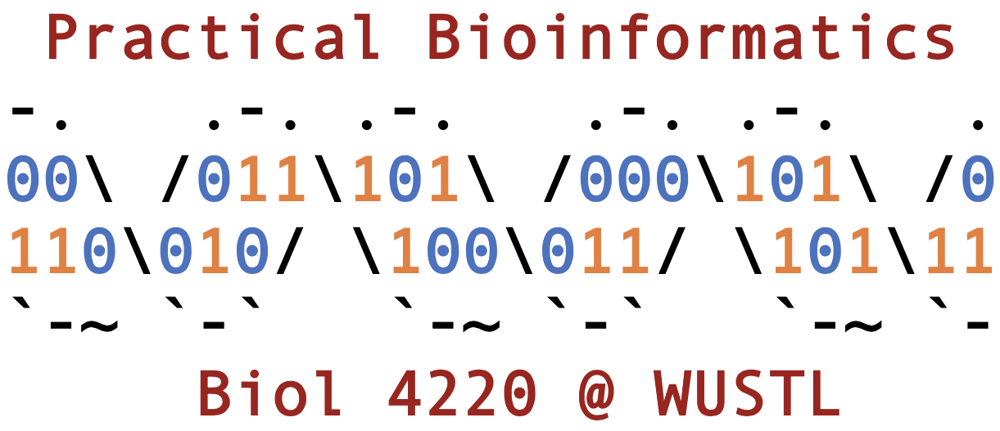

Welcome to the home page for the **Fall 2020** class of Biol 4220!

### Course resources
* [Lecture & lab schedule](course_schedule.md)
* [GitHub Classroom](https://classroom.github.com/classrooms/69019055-practical-bioinformatics-f2020)
* ["How To" guide](how_to_guide.md)
* [Course Project](course_project.md)
* [Syllabus](https://docs.google.com/document/d/1TYE10600VUhCyq51_h_9flVUhkCF-IQCE9SnQKRGRGo/edit?usp=sharing)
* [Canvas](https://wustl.instructure.com/courses/54531)
* [Canvas files](https://wustl.instructure.com/courses/54531/files)

### Course info
* Zoom meeting: [link]() (updated for Aug 14)
* Class hours: 08:30a - 12:00p, Mon and Wed
* Class room: Meeting online due to Covid-19
* Office hours: 01:00p - 02:00p, Mon and Wed
* Office room: 210 Rebstock

### Contact info
* Instructor: Michael Landis
* Email: michael.landis@wustl.edu
* Phone: 314-935-8082
