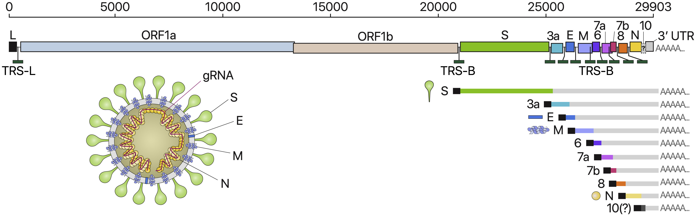

# Course project

## Overview

Practical Bioinformatics (Biol4220) students will build a bioinformatics pipeline to analyze the spread of SARS-CoV-19. This document outlines the technical requirements for the pipeline steps. Each step will generally rely on programs and techniques we explored in various course lab assignment, although students are free to incorporate resources and ideas learned outside of the course into their pipeline design.

Each step of the pipeline must run as an independent script or program. As such, each pipeline program will have its own functionality, and its own arguments, options, and output. At the same time, the script for any pipeline may need to produce output or accept input that is compatible with other pipeline steps (for example, sequence alignement in Step 3 will accept the downloaded sequences of Step 2 as input). Each student need to add at least two new custom features. Custom features must be approved by the instructor. The pipeline, once complete, will then be used to analyze a biological dataset.

### Project submission
Students will submit their pipeline projects as GitHub repositories. Each repository will contain all the relevant files needed for a naive user to analyze a provided dataset, or a new dataset. Project repositories must contain the following files:
  - pipeline scripts
  - pipeline manual
  - input dataset
  - analysis output
  - analysis report
  
These materials are described in more detail below.

### Project presentation

At the end of the course, each student will deliver a short presentation of their work on the pipeline project to the class. Your presentation should share:
  - your custom pipeline features
  - an overview of your pipeline settings/datasets
  - an overview of your findings
  - aspects of the pipeline you would like to improve
  - any technical challenges you were proud to overcome
  - ideas for new pipeline features
  
Plan to present for at least 10 minutes. After your presentation, the class will discuss what was presented, and ask the presenter questions.

### Important dates

- Feature ideas must be approved by the instructor by **Wed, Nov 4**
- Students will present their work to the class on **Mon, Dec 14**
- Students will submit their project materials by **Fri, Dec 18**


(*Elements of the pipeline project design were inspired by [https://github.com/roblanf/sarscov2phylo](https://github.com/roblanf/sarscov2phylo).*)

---

## SARS-CoV-2

In 2020, the common name "coronavirus" is synonymous with a specific virus lineage, more precisely known as as Severe Acute Respiratory Syndrome-related Coronavirus-2 (SARS-CoV-2). SARS-CoV-2 is the virus that causes the infectious disease known as COVID-19. The first SARS-CoV was identified in China in 2003, and remained largely contained within that geographical region. A great deal has been learned since then about the molecular basis for how SARS-related coronaviruses infect humans, along with the genomic structure and composition of coronavirus lineages.

This section gives a brief overview of SARS-related coronavirus biology, including the genome architecture of SARS-CoV-2, the apparent functions of different proteins in the genome, and a suggested dataset that could be used to analyze with the pipeline.

Coronaviruses (family [Coronaviridae](https://talk.ictvonline.org/ictv-reports/ictv_9th_report/positive-sense-rna-viruses-2011/w/posrna_viruses/222/coronaviridae)) are enveloped single-stranded RNA viruses. At roughly 30kb in length, coronavirus genomes are large (if not the largest) among RNA viruses. Coronaviridae includes two virus subfamilies, Coronavirinae and Torovirinae. Coronavirinae is further divided into the virus genera *Alphacoronavirus*, *Betacoronavirus* , *Deltacoronavirus* , and *Gammacoronavirus*. SARS-related coronaviruses belong to *Betacoronavirus*, which primarily infect mammals, and include SARS-CoV, MERS-CoV, and now SARS-CoV-2.

The genome structure for SARS-CoV-2 is shown in the image below. 


Major features of the genome include
- Structural proteins (from exterior to interior)
  - S, the spike protein, facilitates the attachment of the virion to the cell, and the entry of the virion into the cell.
  - E, the envelope protein, is the smallest of the structural proteins, facilitates protein-protein interactions and protein-environment interactions, but appears to have varied and "enigmatic" roles
  - M, the membrane protein, mediates the formation of the envelope protein, integrates spike proteins into the envelope protein, and determines the general shape of the viral envelope.
  - N, the nucleocapsid protein, directly binds to the coronavirus RNA genome, encapsulating it.
- The open reading frame, ORF1ab, contains overlapping reading frames that encode the polyproteins PP1ab and PP1a. PPA1ab and PP1a themselves encode 16 nonstructural proteins (NSPs) when cleaved.
- Nonstructural proteins, nsp1 through nsp16, play various roles in replication, transcription, and host translation interference.

Most SARS-CoV-2 sequences are deposited to GenBank as annotated genomes. The following command will download the genome for `MW264435` as a nucleotide-encoded fasta file, with each protein-coding gene stored as a different fasta entry:
```
$ efetch -db nuccore -format fasta_cds_na -id MW264435`
>lcl|MW290939.1_cds_QPI19188.1_1 [gene=ORF1ab] [protein=ORF1ab polyprotein] [partial=3'] [exception=ribosomal slippage] [protein_id=QPI19188.1] [location=join(227..13429,13429..>21122)] [gbkey=CDS]
ATGGAGAGCCTTGTCCCTGGTTTCAACGAGAAAACACACGTCCAACTCAGTTTGCCTGTTTTACAGGTTC
GCGACGTGCTCGTACGTGGCTTTGGAGACTCCGTGGAGGAGGTCTTATCAGAGGCACGTCAACATCTTAA
AGATGGCACTTGTGGCTTAGTAGAAGTTGAAAAAGGCGTTTTGCCTCAACTTGAACAGCCCTATGTGTTC
... more sequence data ...
>lcl|MW290939.1_cds_QPI19189.1_2 [gene=ORF1ab] [protein=ORF1a polyprotein] [partial=3'] [protein_id=QPI19189.1] [location=227..>13356] [gbkey=CDS]
ATGGAGAGCCTTGTCCCTGGTTTCAACGAGAAAACACACGTCCAACTCAGTTTGCCTGTTTTACAGGTTC
GCGACGTGCTCGTACGTGGCTTTGGAGACTCCGTGGAGGAGGTCTTATCAGAGGCACGTCAACATCTTAA
AGATGGCACTTGTGGCTTAGTAGAAGTTGAAAAAGGCGTTTTGCCTCAACTTGAACAGCCCTATGTGTTC
... more sequence data ...
>lcl|MW290939.1_cds_QPI19190.1_3 [gene=S] [protein=surface glycoprotein] [frame=3] [partial=5'] [protein_id=QPI19190.1] [location=<21627..25345] [gbkey=CDS]
GTTTATTACCCTGACAAAGTTTTCAGATCCTCAGTTTTACATTCAACTCAGGACTTGTTCTTACCTTTCT
TTTCCAATGTTACTTGGTTCCATGCTATACATGTCTCTGGGACCAATGGTACTAAGAGGTTTGATAACCC
TGTCCTACCATTTAATGATGGTGTTTATTTTGCTTCCACTGAGAAGTCTAACATAATAAGAGGCTGGATT
... and so on ...
```

Below is a list of accessions for a set of viruses sampled in November, with one sequence from across the United States. Every state is represented once, except for Delaware (DE) and North Dakota (ND). Washington, DC, (DC) and Puerto Rico (PR) were included.

```
AK,MW264435
AL,MW064314
AR,MW190821
AZ,MW190194
CA,MW276155
CO,MW190239
CT,MW190240
DC,MT929039
DE,
FL,MW286516
GA,MW190459
HI,MW190887
IA,MT806782
ID,MW190249
IL,MW191367
IN,MW190377
KS,MW064605
KY,MT365025
LA,MW190659
MA,MW190252
MD,MW292629
ME,MW190472
MI,MW190276
MN,MW288251
MO,MW190916
MS,MW065196
MT,MW221270
NC,MT997204
ND,
NE,MT325592
NH,MW064686
NJ,MW190663
NM,MW269882
NV,MW190917
NY,MW264424
OH,MW190278
OK,MT998442
OR,MW190447
PA,MW190279
PR,MW191154
RI,MT344960
SC,MW191276
SD,MT846549
TN,MW191277
TX,MW284540
UT,MW241167
VT,MT472623
VA,MW280449
WA,MT982401
WI,MW190935
WV,MW065351
WY,MW065213
```

These accessions are only for your convenience. You're free to analyze any SARS-CoV-2 genetic dataset that you wish. That dataset might focus on a particular geographical region, a particular time period, or on different aspects of the nonstructural proteins.

---

## Pipeline script, `pipeline.sh`

Students will write a bioinformatics pipeline script that accepts a settings file name as an argument.

### Usage

`./pipeline.sh SETTINGS_FILE [JOB_DIR]`

### Behavior

The script `pipeline.sh` itself runs seven other pipeline steps, in the general order:

1. Parse settings
2. Gather sequences
3. Align sequences
4. Estimate phylogenetic tree from alignment
5. Characterize variation in molecular alignment
6. Test for signatures of positive selection
7. Generate output files

```
# pipeline schematic
# (order of steps)
                 
                  + → 6 ──+
                  |   ↓   ↓
 in → 1 → 2 → 3 → 4 → 7 → out
                  |       ↑
                  + → 5 ──+ 
```

Don't forget, each student must **add two or more custom features** to his/her pipeline. Where those steps will fit into the above schematic will depend on exactly what the features are.

All output is stored into the optional directory targetted by `JOB_DIR`. If no argument is provided for `JOB_DIR`, then the script outputs results into the directory `tmp`. The script creates the directory if it does not exist.


---

## 1. `parse_settings.sh`

This script will parse analysis settings from a setting file. Users will provide two arguments: (1) the file path to the pipeline settings file, and (2) the name of the pipeline step to parse.

### Usage

`./parse_settings.sh SETTINGS_FILE PIPELINE_STEP`

### Behavior

The pipeline settings file stores comma-separated values in the following format:
```
script,settings
get_seq.sh,accession=my_accessions.txt;overwrite=true;
make_align.sh,
make_phylo.sh,
make_mol_stats.py,
make_dnds.py,
make_results.py,
feature1.sh,setting1=my_feature1_settings.txt;parameter1=20;
feature2.py,setting2=my_feature2_settings.txt;parameter2=50;
```
The `script` column identifies a pipeline step by the script name. The `settings` column contains a list of `;`-delimited setting variables following the pattern `variable1=value1;variable2=value2;`.

For example, if we called `./parse_settings.sh settings.txt get_seq.sh` we should locate the row for the step labeled `get_seq.sh` then parse the settings string `accession=my_accessions.txt;overwrite=true;`. The `parse_settings.sh` script will then reformat the settings for a given pipeline step as-needed. Users may provide all or only some settings for any pipeline step. 

---

## 2. `get_seq.sh`

*(Relevant labs and lectures: 03A, 03B, 04A)*

The `get_seq.sh` manages and downloads fasta-formatted accessions from GenBank. As input, the script accepts two arguments: (1) a list of accessions, and (2) a directory where the sequences are managed. The script will then check whether each accession has already been downloaded into the managed directory, download any missing sequences, and append any issues to the file `warnings.log`.

### Usage

`./get_seq ACCESSION_FILE SEQUENCE_DIR`

### Behavior

The file `ACCESSION_FILE` will contain a list of accessions. Example format:
```
A12345678
H32183282
B32701283
G63645551
```

The script will:

1. Identify whether fasta-formatted accession already exists in the `SEQUENCE_DIR` subdirectory. For example, for accession `A12345678` the script will see whether `sequences/A12345678.fasta` exists.
     a. If the accession *does* exist, the script will further validate that the file contains two lines: line 1 contains the fasta description, e.g. `>sample_1|A12345678`; line 2 contains the sequence 
data, e.g. `ACGTACGTACT`.
     b. If the accession exists but is *invalid*, delete the accession from `SEQUENCE_DIR` and mark it to be downloaded. Record deleted files in the file `warnings.log`.

2. For each missing accession -- either because it was not downloaded or because it was deleted for being invalid -- download that accession from GenBank. 
     a. Download and rename each GenBank accession as a fasta file. For example, accession `A12345678` fetched from GenBank using the `equery` and `efetch` commands, and saved as `A12345678.fasta`
     b. Invalid accessions that do not exist on GenBank will fail to download; report to `warnings.log` which files failed to download
     
---

## 3. `make_align.sh`

*(Relevant labs and lectures: 03B, 04B)*

This script will align a set of fasta sequences located in a target directory.

### Usage

`./make_align SEQUENCE_DIR ALIGN_TOOL [ALIGN_TOOL_OPTIONS]`

### Behavior

The `make_align.sh` script will align the sequences in `SEQUENCE_DIR` using the method `ALIGN_TOOL` and the options defined in `ALIGN_TOOL_OPTIONS`.

The script will concatenate all fasta files in `SEQUENCE_DIR`, then take that concatenated sequence file as input for the alignment procedure. The script will then align the sequence file using a supported alignment tool (specified by `ALIGN_TOOL`), where supported tools must include Muscle, MAFFT, and PRANK. Students are welcome to add support for additional tools, but they will need to install that software on their virtual machine. The alignment procedure will use arguments/options passed in through `ALIGN_TOOL_OPTIONS`. Note that invalid input and/or invalid software options may cause the alignment software to fail. Script failures you encounter should be logged in `warnings.log`

In addition to supporting input and output arguments, other `ALIGN_TOOL_OPTIONS` to support are
- Muscle: gap open penalty (`-gapopen`)
- MAFFT: gap open penalty (`--op`) and gap extension penalty (`--ep`)
- PRANK: gap rate (`-gaprate`), gap extension probability (`-gapext`)

The script should write two files as output: (1) the output alignment file and (2) a log file that documents the alignment settings. If the `SEQUENCE_DIR` was `primates_cytb` and `ALIGN_TOOL` was MAFFT, then the output file should be saved as `primates_cytb.align_mafft.fasta` and `primates_cytb.align_mafft.log`.

The log file should report
- the name of the alignment file
- the command string used to align the sequences
- when the alignment was created (use output of `date`)
- the number of sequences and the number of sites in the aligned sequence
- (optional) the version of the alignment software
- (optional) list of the aligned accessions

---

## 4. `make_phylo.sh`

*(Relevant labs and lectures: 06A)*

This script will estimate a phylogeny from a multiple sequence alignment.

### Usage

`./make_phylo ALIGNMENT_FILE PHYLO_TOOL [PHYLO_TOOL_OPTIONS]`

### Behavior

The `make_phylo.sh` script will infer a phylogeny using the alignment stored in `ALIGNMENT_FILE` using the software `PHYLO_TOOL` under the settings `PHYLO_TOOL_OPTIONS`. The script must support the phylogenetic inference methods: FastTree, IQ-Tree, and MPBoot. Students are welcome to include additional phylogenetic methods, but they will need to install that software on their virtual machine. The phylogenetic inference procedure will use arguments/options passed in through `PHYLO_TOOL_OPTIONS`. Note that invalid input and/or invalid software options may cause the phylogenetics software to fail. Script failures you encounter should be logged in `warnings.log`

In addition to supporting input and output arguments, other `PHYLO_TOOL_OPTIONS` to support are
- FastTree: gap open penalty (`-gapopen`)
- IQ-Tree: gap open penalty (`--op`) and gap extension penalty (`--ep`)
- MPBoot: gap rate (`-gaprate`), gap extension probability (`-gapext`)

The script should write three files as output: (1) the output phylogenetic estimate stored as a Newick string, (2) a text representation of the phylogeny using NW Utilities, and (3) a log file that documents the phylogenetic inference settings. If the `ALIGNMENT_FILE` was `primates_cytb.align_mafft.fasta` and `PHYLO_TOOL` was FastTree, then the output file should be saved as `primates_cytb.align_mafft.phylo_fasttree.tre`, `primates_cytb.align_mafft.phylo_fasttree.nw_display.txt`, and `primates_cytb.align_mafft.phylo_fasttree.log`.

The log file should report
- the name of the file containing the phylogenetic estimate, in Newick format
- the command string used to infer the phylogeny
- when the phylogeny was created (use output of `date`)
- (optional) the version of the phylogenetic software


---

## 5. `make_mol_stats.py`

*(Relevant labs and lectures: TBD)*

The `make_mol_stats.py` script generates a report of various summary statistics and transformations for a multiple sequence alignment.

### Usage

`./make_mol_stats.py ALIGNMENT_FILE`

### Behavior

This Python script will perform several steps:
1. Store `ALIGNMENT_FILE` into a container
2. Compute the GC-richness for each sequence
3. Compute the GC-richness for each site
4. Determine whether or not each site is phylogenetically informative.
5. Find all coding regions and all codons
6. Compute codon frequencies per site and per sequence
7. Compute biased codon usage proportions across amino acids, sites, and sequences

Precise definitions for GC-richness, codons, codon usage frequencies, and phylogenetic informativeness are defined in Lab [XX]() (TBD). Briefly, GC-richness is the proportion of sites that are in G or C rather than A or T. Codons are the nucleotide triplets that encode amino acids during translation. Codon usage frequencies are the proportions that a particular codon-type is used to encode a particular amino acid. A phylogenetically informative site is an alignment site that contains at least two individuals of one variant, and at least two individuals of a different variant -- i.e. the site contains enough information to identify a phylogenetic "split".

As output, this script should output five files in .csv format. The beginning of these files will share the name of the alignment 
- `prefix.seq_GC.csv`
- `prefix.site_GC.csv`
- `prefix.seq_phylo_inf.csv`
- `prefix.site_codon.csv`
- `prefix.seq_codon.csv`
- `prefix.codon_usage.csv`
where `prefix` is the alignment name except the file extension (`.fasta`) e.g. `primates_cytb.align_mafft` from `primates_cytb.align_mafft.fasta`.

---

## 6. `make_dnds.py`

*(Relevant labs and lectures: TBD)*

The `make_dnds.sh` script will test for the molecular signature of positive selection using the modeling software, PAML. 

### Usage

`./make_dnds.py ALIGNMENT_FILE PHYLOGENY_FILE [PAML_OPTIONS]`

### Behavior

This script accepts a multiple sequence alignment and a phylogenetic tree as input to process using PAML. PAML settings are managed through a control file (`.ctl`); this script accepts `PAML_OPTIONS` that are then reformatted accordingly into the PAML control file. At a minimum, `PAML_OPTIONS` should support the settings XX, XX, XX.

The script should read in the default PAML output, saving per-site dN/dS scores as a csv file in `${SEQUENCE_NAME}.site_dnds.csv` and a Newick string estimated using the PAML codon model titled `${SEQUENCE_NAME}.paml.tre`.

As output, this script should output five files in .csv format. The beginning of these files will share the name of the alignment -- e.g. `primates_cytb.align_MAFFT.fasta`
- `prefix.paml.tre`
- `prefix.site_dnds.csv`

---

## 7. `make_results.py`

*(Relevant labs and lectures: TBD)*

This file will collect all pipeline output located in the target sequence directory, then combine any compatible results and/or logs and generate figures.

### Usage

`./make_results.py SEQUENCE_DIR [RESULTS_OPTIONS]`

### Behavior

This script should generate a `README.md` file in `SEQUENCE_DIR` that lists the analysis settings and the output files for each step. For example
```
# ./pipeline.sh my_settings.csv job1
# ./parse_settings.sh my_settings.csv
# ./get_seq.sh primates_cytb
primates_cytb/A12345678
primates_cytb/H32183282
primates_cytb/B32701283
primates_cytb/G63645551
# ./make_align.sh sequences mafft '-op 2 -ep 1'`
job1/primates_cytb.align_mafft.fasta
job1/primates_cytb.align_mafft.log
# ./make_phylo job1/primates_cytb.align_mafft.fasta fasttree '-noml'
job1/primates_cytb.phylo_fasttree.tre
job1/primates_cytb.phylo_fasttree.nw_display.txt
job1/primates_cytb.phylo_fasttree.log
# ./make_mol_stats.py job1/primates_cytb.align_mafft.fasta
primates_cytb.align_mafft.seq_GC.csv
primates_cytb.align_mafft.site_GC.csv
primates_cytb.align_mafft.seq_phylo_inf.csv
primates_cytb.align_mafft.site_codon.csv
primates_cytb.align_mafft.seq_codon.csv
primates_cytb.align_mafft.codon_usage.csv
# ./make_dnds.py job1/primates_cytb.align_mafft.fasta job1/primates_cytb.align_mafft.phylo_fasttree.tre '-some_setting'
primates_cytb.align_mafft.phylo_fasttree.paml.tre
primates_cytb.align_mafft.phylo_fasttree.site_dnds.csv
# ./make_results.py SEQUENCE_DIR [RESULTS_OPTIONS]
fig_phy.primates_cytb.align_mafft.phylo_fasttree.pdf
fig_plot.primates_cytb.align_mafft.phylo_fasttree.pdf
```

---

## Pipeline manual

Create short manual entries for your two (or more) custom pipeline steps. These entries should define the usage and behavior the scripts in a comparable detail to the entries in this document (`course_project.md`).

---

## Analysis report

Write a 1-2 page report (12pt font, single-spaced) that summarizes your research findings. At a minimum, report should contain these components:

1. An overview of your pipeline, the pipeline features, and the analysis results.
2. A detailed description of the custom pipeline features that you added to the project, why they might be interesting or useful, and any challenges you encountered introducing those features.
3. A discussion of how your analysis output (results) differed depending on what settings/datasets you analyzed, and how those differences might influence what biological hypotheses are supported or rejected. For example, an analysis run under Settings-A might cause our methods to infer high proportions of nonsynonymous substitutions relative to synonymous substitutions, while Settings-B might cause our methods to infer roughly equal proportions of nonsynonymous and synonymous substitutions. Do Settings-A and Settings-B support conflicting biological scenarios? Why is it important to compare results using both settings? 
